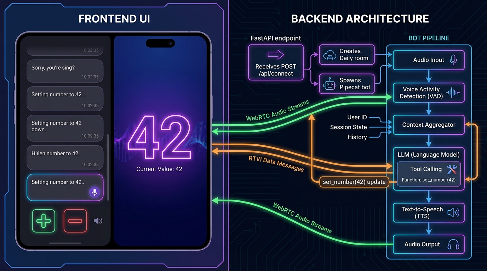
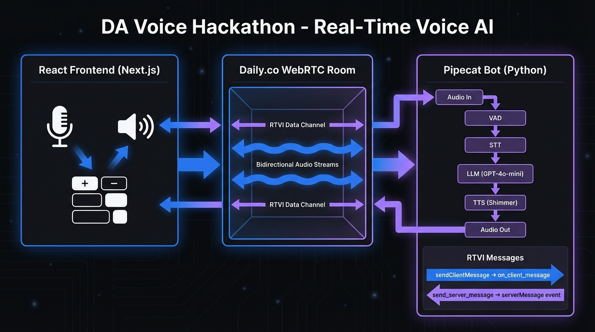
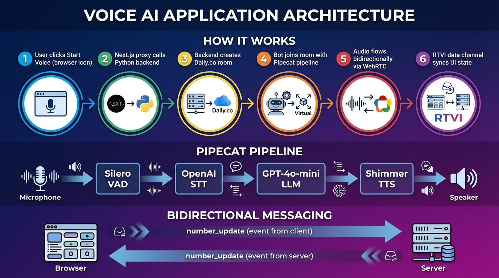
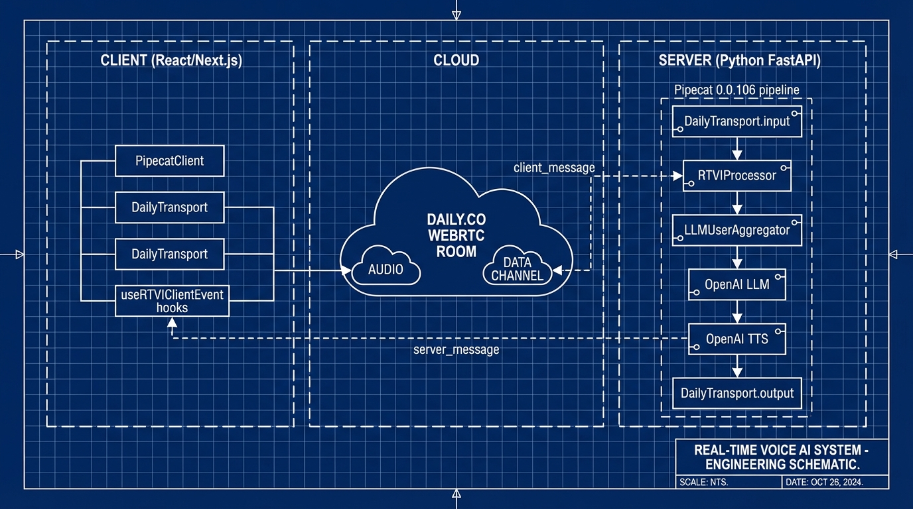
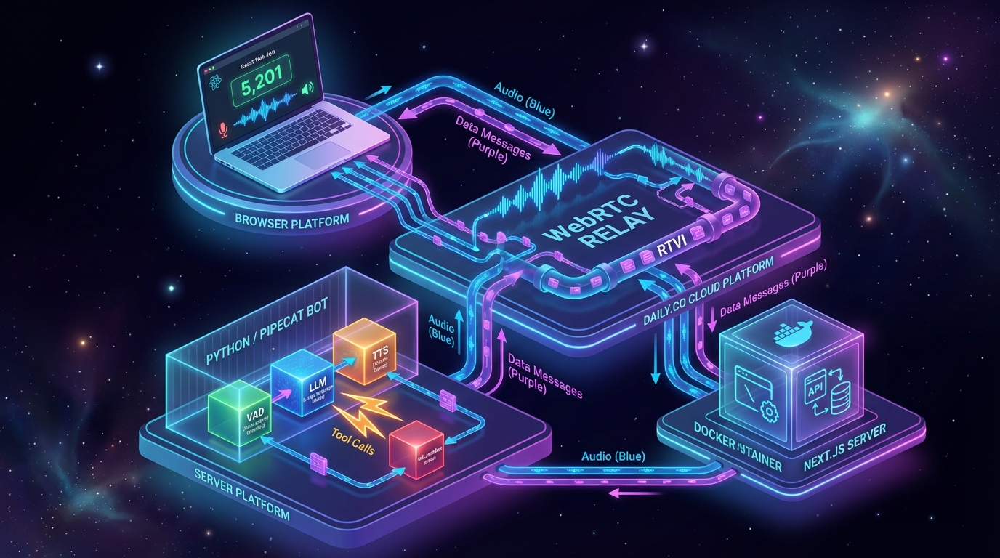

# DA Voice Hackathon

Project for the March 23rd Mini Hackfest with [AI Tinkerers Durango](https://durango.aitinkerers.org/).

**Event:** [AI Tinkerers Durango Mini Hackfest — 3 Hours, 3 Projects](https://durango.aitinkerers.org/p/ai-tinkerers-durango-mini-hackfest-3-hours-3-projects)

**Goal:** Build a Jarvis-style voice AI — bidirectional voice conversation tightly coupled with a reactive app UI. Talk to it, see the results. Click the UI, hear the response.

## Architecture



<details>
<summary>Alternative diagrams</summary>

| v1 | v2 | v3 | v5 |
|:--:|:--:|:--:|:--:|
| [](docs/architecture-v1.png) | [](docs/architecture-v2.png) | [](docs/architecture-v3.png) | [](docs/architecture-v5.png) |

</details>

---

## App Ideas

Pick a project, fork the repo, and start hacking. Each idea pairs real-time voice interaction with a visual, interactive frontend.

<table>
<tr>
<td align="center" width="50%">
<br/>
<strong>Biology Anatomy Explorer</strong><br/>
3D heart modeling, voice-controlled layers, real-time simulations
</td>
<td align="center" width="50%">
<br/>
<strong>Map Time Traveler</strong><br/>
Historical border shifts, voice-activated events, geopolitical data
</td>
</tr>
<tr>
<td align="center">
<br/>
<strong>Collaborative Storybook</strong><br/>
Dynamic storytelling, voice-triggered SFX, branching paths
</td>
<td align="center">
<br/>
<strong>Language Immersion AI</strong><br/>
Real-world scene interaction, visual feedback, contextual vocab
</td>
</tr>
<tr>
<td align="center">
<br/>
<strong>Financial What-If Planner</strong><br/>
Retirement modeling, voice-adjusted variables, live charts
</td>
<td align="center">
<br/>
<strong>Real-time Data Analyst</strong><br/>
Voice-queried dashboards, dynamic filtering, anomaly alerts
</td>
</tr>
<tr>
<td align="center">
<br/>
<strong>Music Theory Visualizer</strong><br/>
Real-time chord ID, interactive staff, harmonic analysis
</td>
<td align="center">
<br/>
<strong>Zen Garden Gardener</strong><br/>
3D landscaping, voice-controlled raking, generative placement
</td>
</tr>
</table>

---

## Project Setup

### 1. Clone the repo

```bash
git clone https://github.com/<your-org>/da-voice-hackathon.git
cd da-voice-hackathon
```

### 2. Create the `.env` file

Copy the values provided at the hackathon into a `.env` file at the project root:

```
OPENAI_API_KEY=<provided>
DAILY_API_KEY=<provided>
AI_REALTIME_URL=http://server:8000
```

### 3. Run with Docker Compose

```bash
docker compose up --build
```

This starts two services:
- **server** — Python/FastAPI backend on port `8000` (Pipecat voice pipeline)
- **web** — Next.js frontend on port `3000` (waits for server to be healthy)

Open [http://localhost:3000](http://localhost:3000) and start talking.

---

## (Optional) Dev Setup — AI Coding Tools

You can use different AI coders than you're used to. We recommend trying **opencode** if you haven't before.

### opencode

Install:

```bash
curl -fsSL https://opencode.ai/install | bash
```

Then launch it in your project directory:

```bash
opencode
```

Use `/connect` to authenticate with a provider, then `/models` to pick a model.

---

### MiniMax M2.7 Highspeed

Model: `minimax/MiniMax-M2.7-highspeed`

#### With opencode

1. Run `/connect` and search for **MiniMax**
2. Paste your MiniMax API key
3. Run `/models` and select **M2.7**

#### With Claude Code

Add to `~/.claude/settings.json`:

```json
{
  "env": {
    "ANTHROPIC_BASE_URL": "https://api.minimax.io/anthropic",
    "ANTHROPIC_AUTH_TOKEN": "<YOUR_MINIMAX_API_KEY>",
    "API_TIMEOUT_MS": "3000000",
    "CLAUDE_CODE_DISABLE_NONESSENTIAL_TRAFFIC": "1",
    "ANTHROPIC_MODEL": "MiniMax-M2.7",
    "ANTHROPIC_SMALL_FAST_MODEL": "MiniMax-M2.7",
    "ANTHROPIC_DEFAULT_SONNET_MODEL": "MiniMax-M2.7",
    "ANTHROPIC_DEFAULT_OPUS_MODEL": "MiniMax-M2.7",
    "ANTHROPIC_DEFAULT_HAIKU_MODEL": "MiniMax-M2.7"
  }
}
```

Then run `claude` in your project directory and select "Trust This Folder."

Full docs: [MiniMax Claude Code Setup](https://platform.minimax.io/docs/token-plan/claude-code)

---

### Cerebras GLM 4.7 (Ferrari)

Model: `cerebras/zai-glm-4.7`

#### With opencode

1. Get an API key from the [Cerebras Console](https://inference.cerebras.ai/)
2. Run `/connect` and search for **Cerebras**
3. Paste your API key
4. Run `/models` and select **zai-glm-4.7**

Cerebras provides fully managed inference with extremely fast speeds — great for rapid iteration during the hackathon.
